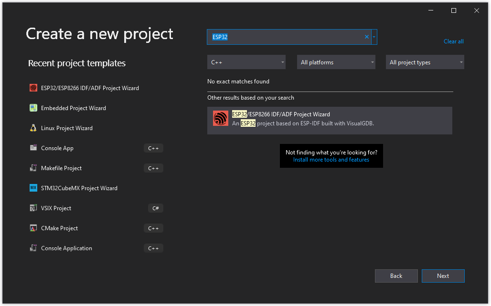
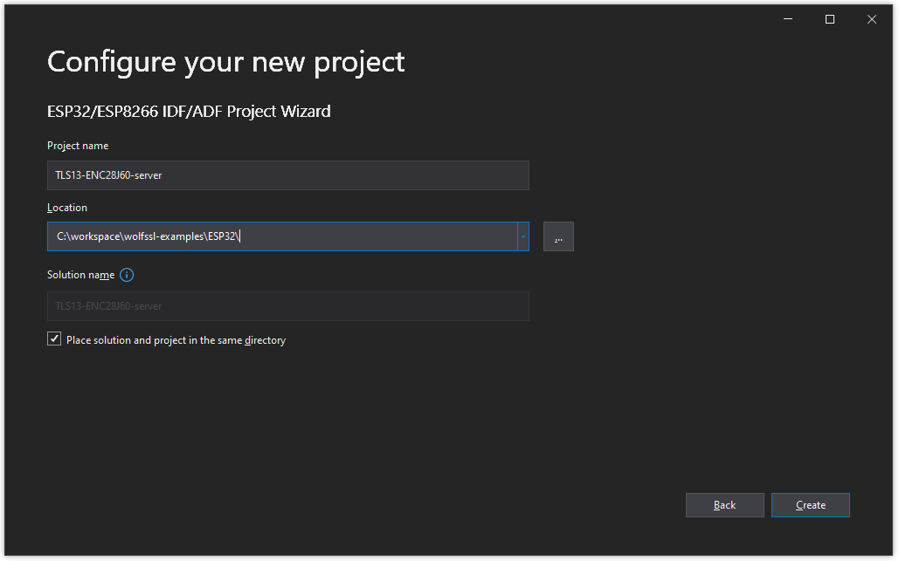
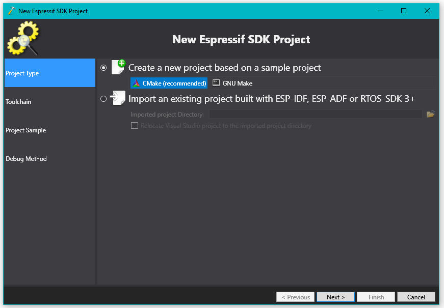
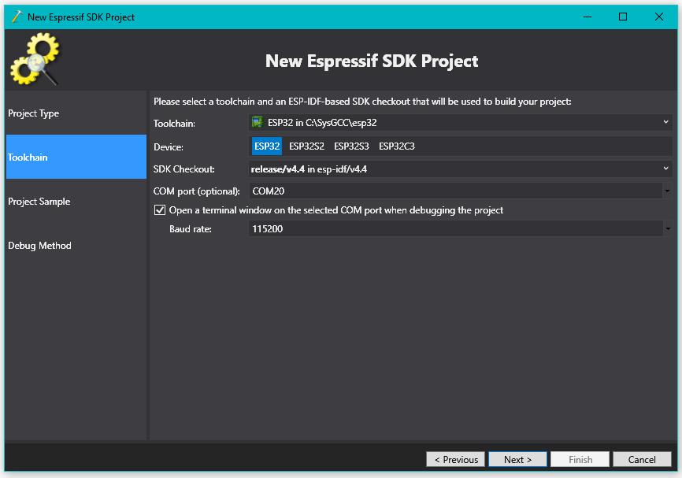
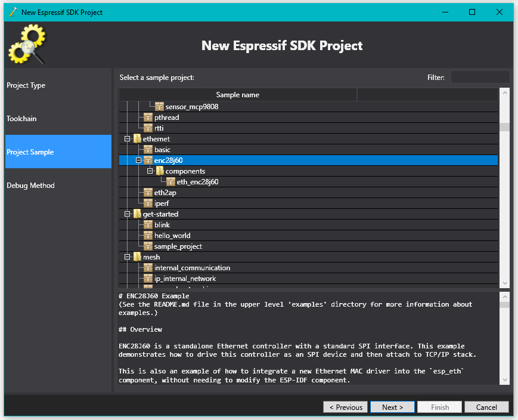
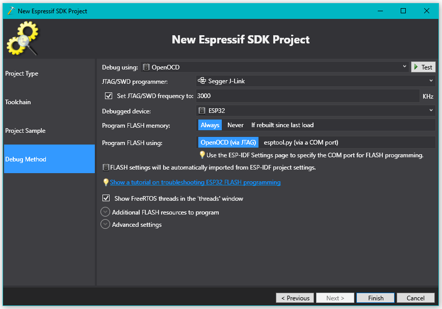

# wolfSSL ESP32 Examples

These are wolfSSL TLS 1.3 clients and servers for both wired and wireless Internet.

Note: wolfSSL v5.5.4 or newer is needed to use these examples with ESP-IDF v5.

See the [setup scripts](https://github.com/wolfSSL/wolfssl/tree/master/IDE/Espressif/ESP-IDF) to install.


## ESP32 TLS 1.3 Server

- [Wireless STA server](./TLS13-wifi_station-server/README.md)
- [Wired ENC28J60 server](./TLS13-ENC28J60-server/README.md)

coming soon:
- Wireless AP client
- Arduino client

## ESP32 TLS 1.3 Client

- [Wireless STA client](./TLS13-wifi_station-client/README.md)
- [Wired ENC28J60 client](./TLS13-ENC28J60-client/README.md)

coming soon:
- Wireless AP server
- Arduino server

<br />

## Creating VisualGDB Projects













<br />

## ESP-IDF

Although the examples were created using VisualGDB extension for Visual Studio, the 
examples can of course be compiled using the ESP-IDF `idf.py`.

Once the EDP-IDF is installed, use the [setp_win.bat](https://github.com/wolfSSL/wolfssl/blob/master/IDE/Espressif/ESP-IDF/setup_win.bat) to copy wolfSSL files to
the `esp-idf\components` directory, typically in 
`C:\Users\%username%\esp\esp-idf\components` or `C:\Users\%username%\Desktop\esp-idf\components`.
Be sure to run the `ESP-IDY X.Y CMD` command prompt that has `%IDF_PATH%` defined.


```
cd \workspace\
git clone https://github.com/wolfSSL/wolfssl.git
cd wolfssl\IDE\Espressif\ESP-IDF\
.\setup_win.bat
```

Build with VisualGDB toolchain from WSL
```
. /mnt/c/SysGCC/esp32/esp-idf/v5.0/export.sh
idf.py -b 115200 -p /dev/ttyS15 build flash monitor
```


## Tips

If JTAG gets into a mode where it is simply always returning an error (app continually resetting)
try using serial port to program a basic, operational ["hello world"](./ESP32-hello-world/README.md). 
The Arduino IDE or command-line ESP-IDF can be handy here.

## Toolchain Switching in VisualGDB

Due to occasional difficulty in switching between toolchains, separate VisualGDB solution
files are included for ESP-IDF v4.4.1 and v5.0.

See the `ProjectModeSettings` of the respective .`vgdbproj` file:

```
      <ESPIDFExtension>
        <IDFCheckout>
          <Version>release/v5.0</Version>
          <Subdirectory>esp-idf/v5.0</Subdirectory>
          <Type>ESPIDF</Type>
        </IDFCheckout>
        <COMPort>COM20</COMPort>
        <SuppressTestPrerequisiteChecks>false</SuppressTestPrerequisiteChecks>
        <UseCCache>false</UseCCache>
        <DeviceID>ESP32</DeviceID>
      </ESPIDFExtension>
```

## See also:

- [wolfSSL](https://www.wolfssl.com/)
- [Espressif](https://www.espressif.com/)

- [wolfSSL Quick Start Guide](https://www.wolfssl.com/docs/quickstart/)
- [github.com/wolfSSL/wolfssl](https://github.com/wolfSSL/wolfssl)
- [wolfSSL blog: ESP32 Hardware Acceleration Support](https://www.wolfssl.com/wolfssl-esp32-hardware-acceleration-support/)
- [wolfSSL blog: Support for ESP-IDF and ESP32-WROOM-32](https://www.wolfssl.com/wolfssl-support-esp-idf-esp32-wroom-32/)
- [wolfSSL Context and Session Set Up](https://www.wolfssl.com/doxygen/group__Setup.html)
- [wolfSSL Certificates and Keys](https://www.wolfssl.com/doxygen/group__CertsKeys.html)
- [wolfSSL Error Handling and Reporting](https://www.wolfssl.com/doxygen/group__Debug.html)
- [wolfSSL Espressif Support Docs](https://www.wolfssl.com/docs/espressif/)
- [wolfSSL Licensing](https://www.wolfssl.com/license/)
- [wolfssl/IDE/Espressif/ESP-IDF](https://github.com/wolfSSL/wolfssl/tree/master/IDE/Espressif/ESP-IDF) (will be migrating to [wolfSSL/wolfssl-examples](https://github.com/wolfSSL/wolfssl-examples/) )
- [wolfssl/error-ssl.h](https://github.com/wolfSSL/wolfssl/blob/master/wolfssl/error-ssl.h)
- [wolfssl/certs_test.h](https://github.com/wolfSSL/wolfssl/blob/master/wolfssl/certs_test.h)
- [Espressif ESP32 Series of Modules](https://www.espressif.com/en/products/modules/esp32)
- [Espressif ESP-IDF Programming Guide](https://docs.espressif.com/projects/esp-idf/en/latest/esp32/index.html)
- [Espressif System Time API](https://docs.espressif.com/projects/esp-idf/en/latest/esp32/api-reference/system/system_time.html)
- [Espressif Networking API](https://docs.espressif.com/projects/esp-idf/en/latest/esp32/api-reference/network/esp_eth.html)
- [linux socket](https://linux.die.net/man/3/socket)
- [linux socket connect](https://linux.die.net/man/3/connect)
- [stackoverflow: What are the differences between .pem, .cer and .der?](https://stackoverflow.com/questions/22743415/what-are-the-differences-between-pem-cer-and-der)
- [esp32.com: How to check cip version](https://www.esp32.com/viewtopic.php?t=16103)
- [VisualGDB Extension for Visual Studio](https://visualgdb.com/)
- [Wireshark](https://www.wireshark.org/)
- [WSL](https://docs.microsoft.com/en-us/windows/wsl/)

<br />

## Support

Please contact wolfSSL at support@wolfssl.com with any questions, bug fixes,
or suggested feature additions.