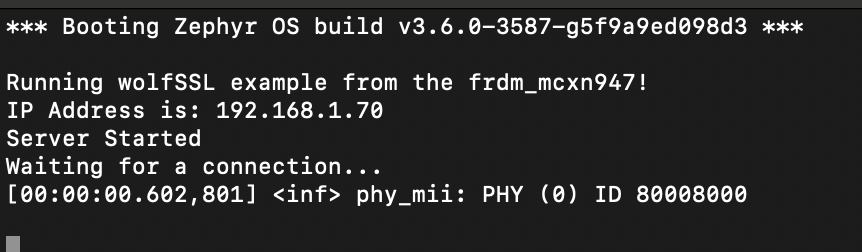
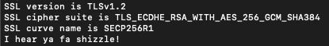

# NXP Application Code Hub

## Zephyr RTOS TLSv1.3 Hello Server FRDM-MCXN947 

This demo demostrate capabilities of new FRDM-MCXN947.  
There has some variants that are divided on branches in [Application Code Hub](https://github.com/nxp-appcodehub)     

### Demo   
Creating a simple server using the Zephyr RTOS and wolfSSL to utilize the networking capabilities of the FRDM-MCXN947 through its ethernet port.  

#### Boards:        FRDM-MCXN947
#### Categories:    RTOS, Zephyr, Networking
#### Peripherals:   UART, ETHERNET
#### Toolchains:    Zephyr

## Table of Contents
1. [Software](#step1)
2. [Hardware](#step2)
3. [Setup](#step3)
4. [Verification](#step4)
5. [Project Options](#step5)
6. [FAQs](#step6) 
7. [Support](#step7)
8. [Release Notes](#step8)

## 1. Software
- [MCUXpresso for VScode 1.5.61 or newer](https://www.nxp.com/products/processors-and-microcontrollers/arm-microcontrollers/general-purpose-mcus/lpc800-arm-cortex-m0-plus-/mcuxpresso-for-visual-studio-code:MCUXPRESSO-VSC?cid=wechat_iot_303216)

- [Zephyr Setup](https://docs.zephyrproject.org/latest/develop/getting_started/index.html)
    - [wolfSSL as a Module added to Zephyr](https://github.com/wolfSSL/wolfssl/blob/master/zephyr/README.md)
    - [Adding the Zephyr Repository (Part 5)](https://community.nxp.com/t5/MCUXpresso-for-VSCode-Knowledge/Training-Walkthrough-of-MCUXpresso-for-VS-Code/ta-p/1634002)

- MCUXpresso Installer:
   - MCUXpresso SDK Developer
   - Zephyr Developer
   - Linkserver

- Ubuntu or MacOS with the following packages:
    - autoconf
    - automake
    - libtool
    - make
    - gcc
    - git 

- Optional Software:
    - Wireshark

## 2. Hardware
- [FRDM-MCXN947.](https://www.nxp.com/products/processors-and-microcontrollers/arm-microcontrollers/general-purpose-mcus/mcx-arm-cortex-m/mcx-n94x-and-n54x-mcus-with-dual-core-arm-cortex-m33-eiq-neutron-npu-and-edgelock-secure-enclave-core-profile:MCX-N94X-N54X)   

- USB Type-C cable.
- Ethernet Cable.
- Networking/Router
- Personal Computer.

## 3. Setup

### 3.1 Step 1
1. Open the MCUXpresso in VS Code.

2. Under the "QuickStart Panel" Tab select "Application Code Hub". Then search for this example, and select the folder you want to download it to.

3. Under the "Projects" tab, right click the project and choose "build selected", this should result in no errors

### 3.2 Connect hardware
1. Connect the FRDM-MCXN947 to you computer with the provided USB-C Cable

2. Connect the FRDM-MCXN947 to your network with a ethernet cable

### 3.4 Program and Run the Server
1. Flash the .elf to FRDM-MCXN947, Can be done with right clicking the project and choosing to "flash the selected target"
2. Connect to the Serial Output of the FRDM-MCXN947 via:
    - Screen Command - `screen /dev/tty"MCXN-Port 115200`
    - Some Serial Terminal you are familiar with 
3. Push reset button on the FRDM-MCXN947 board and view the startup message. Note the IP address.

    

4. In a terminal go to the directory /path/to/project/__repo__/modules/crypto/wolfssl and then use the client application.
`./examples/client/client -h <noted ip address> -v 4`

This should produce the following results:
 - Serial Terminal for MCXN947:

    

 - Host Computer Terminal:

    

## 4. Verification (optional)
### 4.1 Download and Install the Wireshark Application
- [Wireshark](https://www.wireshark.org/download.html)

### 4.2 Setting up the Wireshark Application
1. Launch the Wireshark application and select the network device you are using for the example.

    

2. Now setup and apply a filter using the noted ip in step: [3.4.3](#step3)

    

### 4.3 Verifing the Connection Type

1. Run the client hello from step: [3.4.4](#step3) via 

    `./examples/client/client -h <noted ip address> -v 4`

    

2. Check the Wireshark Results, and see if the correct version of TLS is being used.
It should look similar to this example.

    

## 5. Project Options
### 5.1 Setting up a static IPv4 on Zephyr
By default the project is setup to use a DHCP Server, this section will show how to setup a static IP. Please make sure you chose an IP for the device that will not cause a IP confilct on your network.

1. In [src/main.c](src/main.c), look for the following section.

    

2. Set DHCP off for the project by changing

    `#define DHCP_ON 1` 
    
    to

    `#define DHCP_ON 0`

3. Set the `STATIC_IPV4_ADDR` macro to your desired IP, by default it is set to `192.168.1.70`. Make sure the IP you choose does not cause a conflict on your network.

4. Set the `STATIC_IPV4_GATEWAY` macro to your network's gateway. Usally this is `192.168.1.1` on home networks, however this could not always be the case. This is usally the IP of your primary network router.

5. Set the `STATIC_IPV4_NETMASK` macro to your needs. Generally `255.255.255.0` for most use cases.

6. Rebuild the project and flash the device. The IP the device reports back should be the `STATIC_IPV4_ADDR` value you set.

### 5.2 Changing the project to TLSv2
If you want to change the version of TLS to v2 for the project. This can useful for debugging and education to see how a TLS handshake is preformed between devices.

1. In [src/main.c](src/main.c) look for the following section

    

2. Set the `TLS_VERSION` macro from `3` to `2`.

3. Rebuild the project and flash the device.

4. When running the client application use `./examples/client/client -h <noted ip address> -v 3`, this should produce the following results.

    Server App:

    

    Client App:

    

5. If you preform [Verification](#step4) via Wireshark it should produce the following logs:

    

### 5.3 Changing the Server's Port
If you want to change the port from the default `11111`

1. In [src/main.c](src/main.c) locate `#define DEFAULT_PORT 11111`, and change `11111` to the desired port you want to device to use.

2. Rebuild and flash the device.

3. When using `./examples/client/client -h <noted ip address> -v 4` add the option `-p <Desired Port>` so that it is `./examples/client/client -h <noted ip address> -v 4 -p <Desired Port>`

4. To verify the correct port is being is via Wireshark, look in the Info section of the network capture. For this example I changed the device to use port `11110`.

    

## 6. FAQs
No FAQs have been identified for this project.

## 7. Support

#### Project Metadata
<!----- Boards ----->

<!----- Categories ----->

<!----- Peripherals ----->
 

<!----- Toolchains ----->

Questions regarding the content/correctness of this example can be entered as Issues within this GitHub repository.

>**Warning**: For more general technical questions regarding NXP Microcontrollers and the difference in expected funcionality, enter your questions on the [NXP Community Forum](https://community.nxp.com/)

## 8. Release Notes
| Version | Description / Update                           | Date                        |
|:-------:|------------------------------------------------|----------------------------:|
| 1.0     | Initial release on Application Code Hub        | TBD|