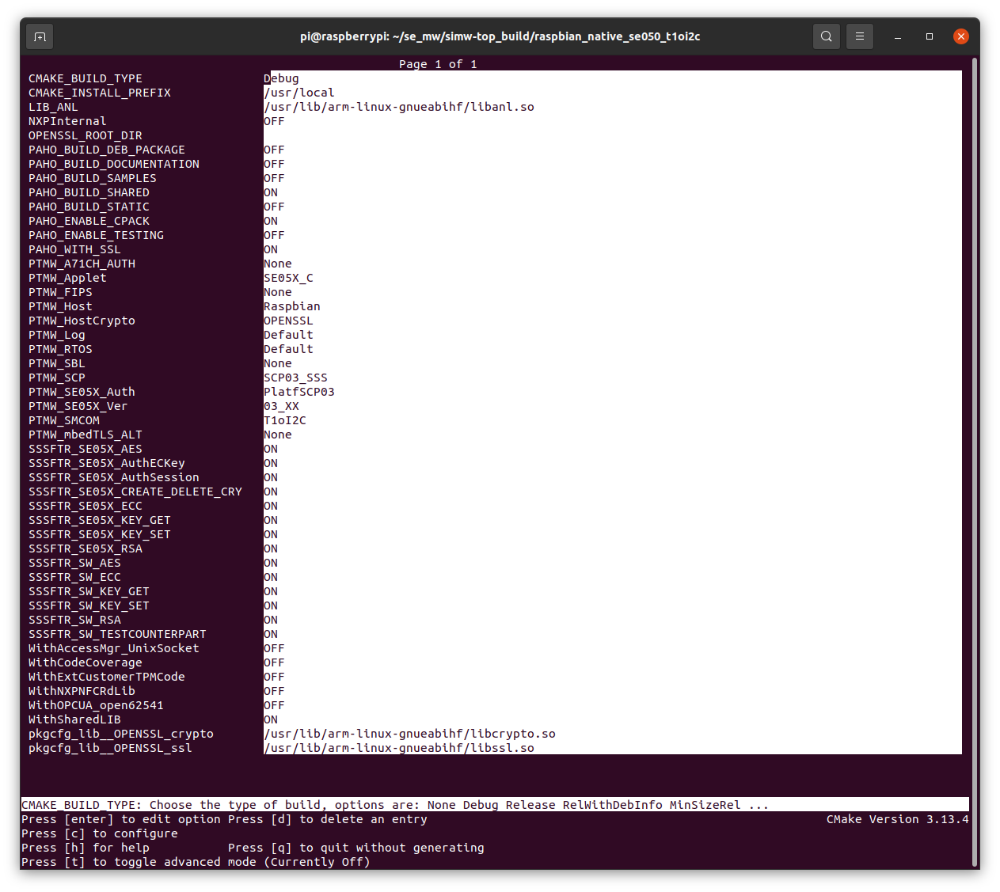

# wolfSSL NXP SE050 Examples

wolfSSL includes support for the NXP SE050 Plug & Trust Secure Element. For
details about the NXP SE050, see [NXP's SE050 page](https://www.nxp.com/products/security-and-authentication/authentication/edgelock-se050-plug-trust-secure-element-family-enhanced-iot-security-with-maximum-flexibility:SE050).

This directory contains wolfSSL examples for NXP SE050. The examples have been
written for and tested on a Raspberry Pi with NXP SE050 EdgeLock development
kit.

For complete details on wolfSSL's support for NXP SE050, see
[README_SE050.md](https://www.github.com/wolfssl/wolfssl/tree/master/wolfcrypt/src/port/nxp/README_SE050.md).
That document also describes how to download, build, and compile the SE05x
Middleware. It should be followed first before moving on to installing and
running these examples.

## Installing Example Applications

These instructions assume that the SE050 middleware has already been installed
in Raspbian and is located at `/home/pi/se_mw/simw-top`. Also that wolfSSL has
been built and installed. See instructions in the wolfSSL repository at
`wolfcrypt/src/port/nxp/README_SE050.md`.

Example SE050 Pi installation steps:

```sh
$ cd se_mw/simw-top
$ mkdir build && cd build
$ ccmake .
# Make sure the following are set:
#    `Host OS` to `Raspbian`
#    `Host Crypto` to `None` (see HostCrypto section below)
#    `SMCOM` to `T1oI2C`
$ c # to configure
$ g # to generate
$ q
$ cmake --build .
$ sudo make install
```

Example wolfSSL installation:

```
./configure --with-se050=/home/pi/se_mw/simw-top/ --enable-keygen --enable-cryptocb \
    --disable-examples --disable-crypttests
make
sudo make install
```

Before building these demos, the "wolfssl" folder which contains these demos
should be copied into the SE05x middleware source tree at: `~/se_mw/simw-top/demos/wolfssl`.
Example: `cp -r wolfssl ~/se_mw/simw-top/demos/`

This will mean the wolfSSL demo applications will be at:

```
~/se_mw/simw-top/demos/wolfssl/wolfcrypt_benchmark
~/se_mw/simw-top/demos/wolfssl/wolfcrypt_generate_csr
~/se_mw/simw-top/demos/wolfssl/wolfcrypt_key_cert_insert
~/se_mw/simw-top/demos/wolfssl/wolfcrypt_test
~/se_mw/simw-top/demos/wolfssl/wolfssl_client
~/se_mw/simw-top/demos/wolfssl/wolfssl_client_cert_key
```

The 'wolfssl' demo directory needs to be tied into the CMake build system. Open
the following file:

```
~/se_mw/simw-top/demos/CMakeLists.txt
```

Add the following at the bottom of this file:

```
ADD_SUBDIRECTORY(wolfssl)
```

If the SE05x middleware has not yet been set up for compilation:

```
$ cd ~/se_mw/simw-top/scripts
$ python ./create_cmake_projects.py rpi
$ cd ~/se_mw/simw-top_build/raspbian_native_se050_t1oi2c
$ ccmake .
< adjust options to match SE050 dev kit >
< 'c', to configure >
< 'g', to generate >
$ cmake --build .
```

This will build the SE05x middleware along with demos, including the wolfCrypt
test application.

**IMPORTANT:** Note that the wolfCrypt test and benchmark application examples
included here need benchmark.c, benchmark.h, test.c, and test.h copied over
from a valid wolfSSL source tree. See notes in those example README.md files
for more information.

```
cp ~/wolfssl/wolfcrypt/benchmark/benchmark.c ./wolfssl/wolfcrypt_benchmark/
cp ~/wolfssl/wolfcrypt/benchmark/benchmark.h ./wolfssl/wolfcrypt_benchmark/
cp ~/wolfssl/wolfcrypt/test/test.c ./wolfssl/wolfcrypt_test/
cp ~/wolfssl/wolfcrypt/test/test.h ./wolfssl/wolfcrypt_test/
```

## NXP SE050 EdgeLock Configuration

wolfSSL most recently tested these examples on a Raspberry Pi with NXP
EdgeLock development kit. The following CMake options were used. This uses
OpenSSL as the HostCrypto Provider and enables SCP03 authentication.



## Example Applications

### wolfCrypt Test Application

This application will run the wolfCrypt test application, running cryptography
test vectors through all algorithms enabled in wolfSSL. For details, see
[README.md](./wolfssl/wolfcrypt_test/README.md).

### wolfCrypt Benchmark Application

This application will run the wolfCrypt benchmark application, benchmarking
all enabled algorithms in wolfSSL. For details, see
[README.md](./wolfssl/wolfcrypt_benchmark/README.md).

### wolfCrypt SE050 Key and Certificate Insertion and Use Example

This example inserts and uses certificates and keys into the SE050. It does an
ECDSA verify operation of an ASCII-encoded {R,S} signature, reads back out the
RSA and ECC certificates imported and verifies they match the original ones,
then erases keys and certificates that were imported into the SE050. For
details, see [README.md](./wolfssl/wolfcrypt_key_cert_insert/README.md).

### wolfCrypt CSR Generation Example

This example generates a Certificate Signing Request (CSR) using a key
generated and stored in the SE050. This examples requires that wolfSSL be
compiled with `--enable-certgen --enable-certreq`. For details, see
[README.md](./wolfssl/wolfcrypt_generate_csr/README.md).

### wolfSSL SSL/TLS Client Example

This example demonstrates a simple SSL/TLS client, using hardware-based
cryptography supported inside the SE050. It loads and uses a certificate
and private key from C arrays/buffers. For a more advanced demo which uses
the private key directly from the SE050, see the following example. For details,
see [README.md](./wolfssl/wolfssl_client/README.md).

### wolfSSL SSL/TLS Client Example with Cert and Private Key in SE050

This example demonstrates a simple SSL/TLS client, using hardware-based
cryptography supported inside the SE050. It loads and uses a certificate
and private key from C arrays/buffers into the SE050, then does all private key
operations inside the SE050 for the TLS private key, based on a key ID.
For details, see [README.md](./wolfssl/wolfssl_client_cert_key/README.md).

## Support

For support questions and issues, please email wolfSSL at support@wolfssl.com.

