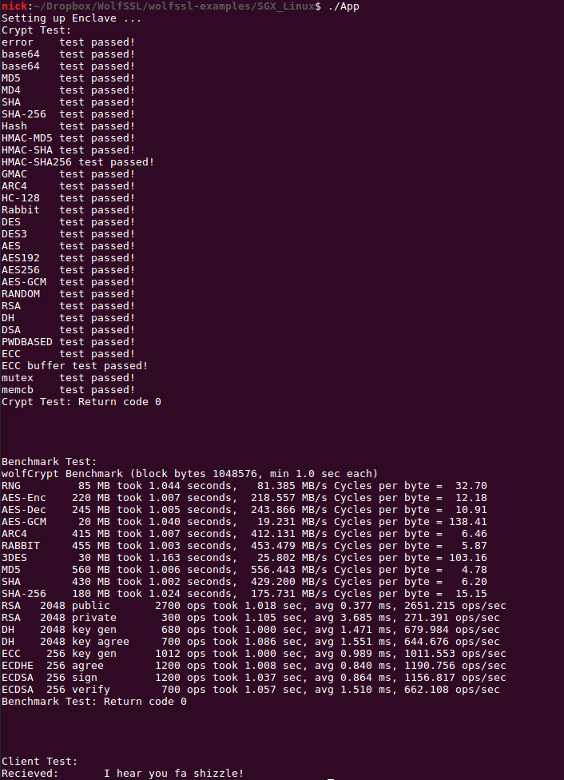

# wolfSSL Linux Enclave Example

This repository contains an example application, written in C, which demonstrates how to link with the wolfSSL lightweight SSL/TLS library with a simple Enclave using Linux. The example has been tested with Ubuntu 16.04.


## Prerequisites

First create the trusted static wolfssl library from `<wolfssl-root>/IDE/LINUX-SGX`. Steps for creating the static library can be found in `<wolfssl-root>/IDE/LINUX-SGX/README.md`

## Build

After creating the static library, build the example untrusted application using make. For make the user should specify:
1. Specify SGX Mode. This can be either SIM or HW

	`SGX_MODE=[SIM,HW]`

2. Whether SGX should be built as Prerelease or regular release

    `SGX_PRERELEASE=[1,0]`

3. Specify if SGX Debug should be set. (This also controls whether wolfssl debug prints, if it was enabled at compile-time for the static library).

    `SGX_DEBUG=[1,0]`

4. The location of the prebuilt static library (this will probably point to `<wolfssl-root>/IDE/LINUX-SGX`)

    `SGX_WOLFSSL_LIB=[location/to/libwolfssl.sgx.static.a]`

5. The location of wolfssl root directory for the header files.

    `WOLFSSL_ROOT=[location/to/wolfssl_root]`

With these three options, simply call, for example:

```make SGX_MODE=SIM SGX_PRERELEASE=0 SGX_WOLFSSL_LIB=~/wolfssl/IDE/LINUX-SGX/ WOLFSSL_ROOT=../../wolfssl SGX_DEBUG=0```

### Expected Output


## Running
After the application has been built, it should be tested against the default wolfssl example server. 

### First, start the example server.
    From <wolfssl-root> run:
    ./examples/server/server

### Then, start the SGX Application
    ./App

This will run three tests. The first is the wolfcrypt testsuite, which tests a variety of wolfcrypt functionality. The second is the wolfcrypt benchmark testsuite, which benchmarks some of the main wolfcrypt ciphers. Finally, a simple TLS client test is run which connects a TLS client, instantiated on the enclave, against the previously started example server running normally on the PC. The connection targets localhost:11111.

### Expected Output




## Limitations

1) Single Threaded

2) No Filesystem

3) Untrusted Code Must Load Private Key/Certificate Chain

    i) In order to successfully load a private key and certificate into the enclave, these APIs are exposed to the untrusted application. This means that the untrusted region must be "trusted" to load the correct Private Key/ Certificate to start a connection. This method of loading certificates should not be used for production code as it violates the trust assumptions for Intel's SGX. Contact <support@wolfssl.com> if you wish to use wolfSSL in your product.

## Support

Please contact wolfSSL at support@wolfssl.com with any questions, bug fixes, or suggested feature additions.

