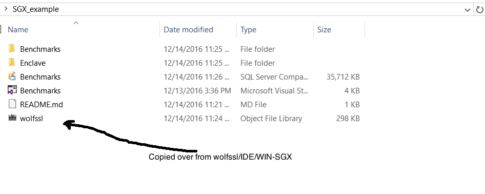
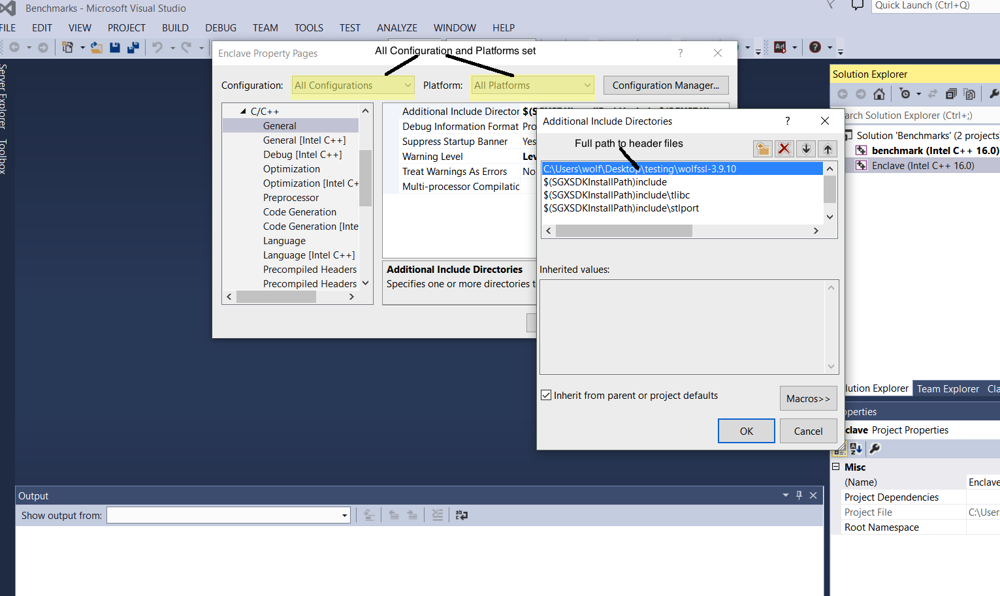
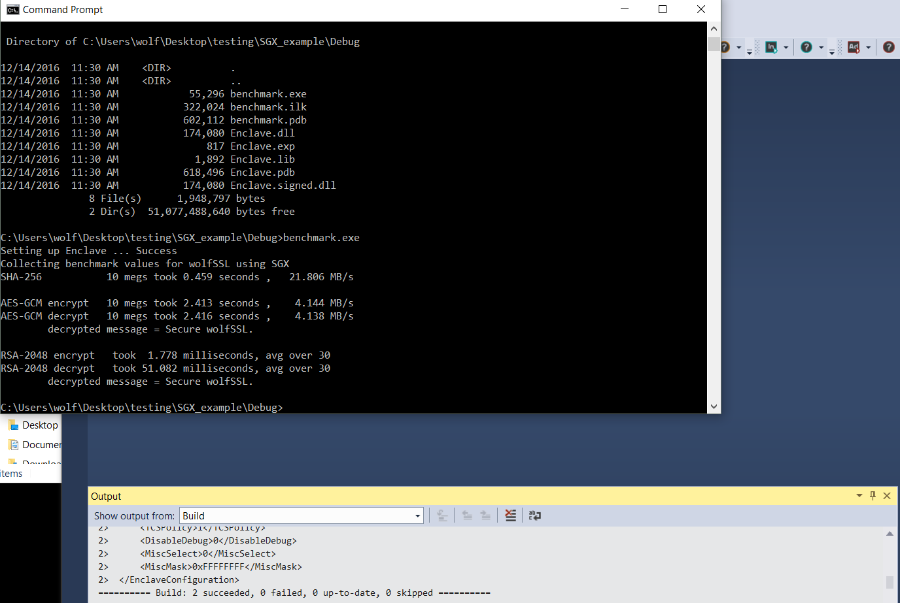

wolfSSL Enclave Example
============================

This repository contains an example application, written in C++, which
demonstrates how to link with the wolfSSL lightweight SSL/TLS library with a
simple Enclave. First create wolfssl.lib from <wolfssl-root>/IDE/WIN-SGX
then copy wolfssl.lib to SGX_example/. Steps for creating wolfssl.lib can be
found in the main wolfSSL directory. <wolfssl-root>/IDE/WIN-SGX/ReadMe.txt.

Note that the example passes pointers using [user_check]. For more information
about what [user_check] is, and precautions needed when developing an application
that uses it, see Intel documentation located here
https://software.intel.com/en-us/sgx-sdk-dev-reference-attribute-user-check. An
application could be developed to completely avoid passing the WOLFSSL_CTX
pointer between trusted and untrusted code for more security.

After creating and moving wolfssl.lib add the include path to wolfSSL header
files. It's suggested to add this with all platforms and all configurations
selected so that it only has to be added once.

Next optionally set the platform toolset for the compiler desired to use.
By default it is set to Intel C++ 16.0.

Below is the expected results when running the created benchmark application.

## Limitations
This code has been developed and tested on Visual Studio 2013 with the
default Intel compiler set. It may work for other versions but building
has not been tested on other versions.

1)Single Threaded
2)Crypto Only
3)AES-NI intrensics not added

## Support

Please contact wolfSSL at support@wolfssl.com with any questions, bug fixes,
or suggested feature additions.

