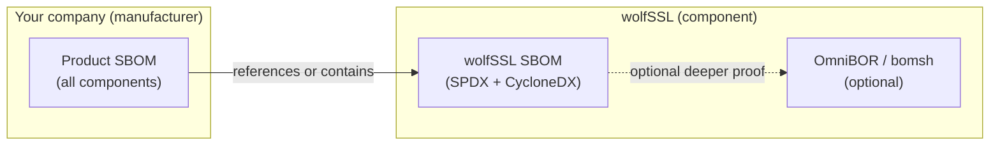

# CRA & Supply Chain Terminology — Customer Cheat Sheet

One-page reference for teams shipping products that include wolfSSL.  
**Not legal advice.** Map obligations to your product class and role with counsel.

This kit is **self-contained** in [wolfssl-examples `cra-kit/`](https://github.com/wolfSSL/wolfssl-examples/tree/master/cra-kit).
Upstream technical reference for the SBOM feature (flags, output formats,
`SBOM_LICENSE_OVERRIDE`, OmniBOR/Bomsh — requires a wolfSSL source tree with
SBOM support):

- [SBOM.md](https://github.com/wolfSSL/wolfssl/blob/master/doc/SBOM.md)

CRA shortlist (4 pillars): [`CRA-Compliance-Shortlist.md`](CRA-Compliance-Shortlist.md) · Who provides what: [`CRA-Cheat-Sheet.md`](CRA-Cheat-Sheet.md) · AI playbook: [`SKILL.md`](SKILL.md) · Worked example: [`auditor-packet/`](auditor-packet/)

---

## The big picture (30 seconds)

| Question | Short answer |
|----------|--------------|
| Do we need **our own** SBOM? | **Yes** — for the **whole product** you place on the EU market. |
| Is wolfSSL’s SBOM enough by itself? | **No** (unless you only redistribute wolfSSL). Use it **inside** your product SBOM. |
| Do we need **bomsh**? | **Usually no.** SBOM alone covers most CRA transparency needs; bomsh adds build traceability if you want it. |
| SPDX or CycloneDX? | **Both are fine.** wolfSSL ships both; use whichever your tools expect (many teams keep both). |

---

## Glossary

| Term | Stands for / means | Plain English |
|------|-------------------|---------------|
| **CRA** | EU **Cyber Resilience Act** | EU law for products with digital elements: inventory, security, vulnerability handling. |
| **SBOM** | **Software Bill of Materials** | Machine-readable “ingredients list” of software in a product (name, version, supplier, license, IDs, relationships). |
| **Product SBOM** | — | **Yours:** every OSS/third-party component in the **shipped product**. |
| **Component SBOM** | — | **wolfSSL’s:** inventory of **wolfSSL only** (`make sbom` or `gen-sbom`). |
| **SPDX** | **Software Package Data Exchange** | A standard **format** for SBOMs (Linux Foundation). Files: `*.spdx.json`, `*.spdx`. |
| **CycloneDX** | (project name) | Another standard **format** for SBOMs (OWASP ecosystem). File: `*.cdx.json`. |
| **NTIA minimum elements** | US NTIA guidance | Checklist of what a “good” SBOM must include (supplier, name, version, unique ID, deps, author, timestamp). CRA practice aligns with this. |
| **PURL** | **Package URL** | Standard ID like `pkg:github/wolfSSL/wolfssl@v5.9.1` — helps tools match components. wolfSSL ships PURLs in both `github` (canonical, resolves in OSV / GHSA / Snyk / Trivy) and CPE forms. |
| **CPE** | **Common Platform Enumeration** | Standard ID like `cpe:2.3:a:wolfssl:wolfssl:…` — used by many vulnerability databases. |
| **VEX** | **Vulnerability Exploitability eXchange** | CycloneDX-side signal: “this CVE does/doesn’t apply to our build.” Often layered on top of SBOM in security tools. |
| **CBOM** | **Cryptographic Bill of Materials** | Inventory of **crypto algorithms/keys/modules** (beyond generic SBOM). Today: `wolfssl:build:*` in CycloneDX; formal CBOM: on the roadmap. |
| **bomsh** | wolfSSL **make** target | Runs **OmniBOR** provenance: proves **how** the library binary was built from sources (**Linux host only**). |
| **OmniBOR** | Omni **Bill of Resources** | Merkle DAG of build inputs/outputs; stored under `omnibor/`. |
| **gitoid** | Git-object-style ID | Hash pointer (`gitoid:blob:sha1:…`) into the OmniBOR graph; appears in `omnibor.*.spdx.json`. |
| **Manufacturer** | CRA role | Entity that places the product on the EU market — **owns** product SBOM and vulnerability process. |
| **Integrator / OEM** | Industry term | You build a device/app containing wolfSSL → you typically act as **manufacturer** for your product. |
| **externalDocumentRefs** | SPDX feature | Your product SPDX **points to** wolfSSL’s SPDX file without copying every file entry. |
| **SOURCE_DATE_EPOCH** | Reproducible builds | Fixed timestamp so two `make sbom` runs produce **byte-identical** SBOMs (useful in CI/attestation). |

---

## CRA structural terms

These appear throughout the kit's "Beyond this kit" guidance. They are **not**
software-transparency artefacts — they are legal/structural CRA obligations
that no SBOM tool can satisfy. **Not legal advice** — engage CRA counsel.

| Term | Article / location | Plain English |
|------|--------------------|---------------|
| **EU Authorised Representative** (EU AR) | Art. 18 | Required if the manufacturer is established **outside** the EU. A written-mandated EU-resident legal entity that receives regulator correspondence on the manufacturer's behalf. Either contract a third-party AR service or use an existing EU subsidiary. **Long-lead** — start now. |
| **Notified Body** | — | Independent third-party conformity-assessment organisation. For "important" or "critical" products (Annex III/IV) the conformity assessment must involve a Notified Body. Queues are long — engage early if you may need one. |
| **Annex III** | Annex III | List of **"important"** products with above-baseline cybersecurity risk (e.g. password managers, network management systems, browsers, certain identity-management components). Triggers stricter conformity assessment than the default class. |
| **Annex IV** | Annex IV | List of **"critical"** products (highest-risk class), e.g. hardware security modules, secure-boot devices, smart-meter gateways of certain types. Always requires Notified Body involvement. |
| **Annex VII** | Annex VII | Required contents of the **technical documentation**: risk assessment, secure-design rationale, vulnerability handling process, support-period commitment, SBOM, etc. Much more than the SBOM alone. |
| **Conformity assessment** | Art. 32 | Process to demonstrate the product meets CRA essential requirements. **Module A** self-assessment (default class) or external review by a Notified Body (important/critical). Output is the declaration of conformity. |
| **Module A** | Annex VIII | Self-assessment conformity procedure. The manufacturer alone performs the assessment and signs the declaration. Default for non-Annex III/IV products. |
| **CE marking** | Art. 30 | Visible mark indicating conformity with applicable EU regulations. Affixed to the product (or packaging/documentation) before placing on the EU market. Backed by the declaration of conformity. |
| **Declaration of conformity** | Art. 28 | Manufacturer's signed statement of CRA compliance. Names the product, lists applicable EU acts, identifies the manufacturer (and EU AR if applicable). |
| **Importer** | Art. 19 | EU entity placing a non-EU product on the EU market. Carries CRA obligations parallel to the manufacturer (verify CE mark, retain AR contact, assist regulators). |
| **Distributor** | Art. 20 | Party in the supply chain making the product available on the EU market without altering it. Lighter obligations than importer/manufacturer, but must verify CE mark and assist regulators. |
| **Support period** | Art. 13(2), 13(8) | Minimum duration during which the manufacturer must provide **free security updates**. Default: at least **5 years**, unless the product is expected to be in use for a shorter period (and longer where the expected lifetime is longer). Must be declared in the technical documentation. |
| **ENISA** | Art. 14, 16 | EU Agency for Cybersecurity. Operates the **Single Reporting Platform (SRP)**; manufacturers file through it and reports reach the **coordinator CSIRT** with ENISA notified **simultaneously** — the **24-hour** early-warning when a vulnerability is **actively exploited**, plus 72-hour update and 14-day final report. |
| **SRP** (Single Reporting Platform) | Art. 16 | ENISA-operated platform (live **11 Sep 2026**) where manufacturers file Art. 14 reports once; routes to the coordinator CSIRT + ENISA and on to affected Member States. |
| **CSIRT** (designated as coordinator) | Art. 14(7) | National incident-response team that receives your Art. 14 report via the SRP and disseminates it. Determined by your EU main establishment — or, for non-EU manufacturers, your **Authorised Representative's** Member State. |
| **EUVD** (European Vulnerability Database) | Art. 16(2) / NIS2 | ENISA's public database where **fixed** vulnerabilities reported via the SRP are published; makes disclosure timelines verifiable. |
| **CNA** | (CVE programme) | **CVE Numbering Authority** — organisation authorised to assign CVE IDs within its scope. wolfSSL is a CNA for wolfSSL libraries. |

For execution detail on these obligations, see [`CRA-Compliance-Shortlist.md`](CRA-Compliance-Shortlist.md) "Beyond this kit (structural CRA obligations)".

---

## wolfSSL artefacts (what we ship)

| Command | Outputs | Answers |
|---------|---------|---------|
| `make sbom` | `wolfssl-<ver>.spdx.json`, `.cdx.json`, `.spdx` | **What** is in wolfSSL (version, license, hashes, config flags). |
| `make bomsh` *(optional)* | `omnibor/`, `omnibor.wolfssl-<ver>.spdx.json` | **How** wolfSSL was built (source → binary traceability). |

Embedded/custom builds: `scripts/gen-sbom` with **your** `user_settings.h` and source list — see kit
[`scripts/generate-embedded-sbom.sh`](scripts/generate-embedded-sbom.sh) and upstream [SBOM.md §1](https://github.com/wolfSSL/wolfssl/blob/master/doc/SBOM.md).

---

## Your checklist

1. **Product SBOM** in release CI (SPDX and/or CycloneDX).
2. **wolfSSL component** — reference our SBOM (`externalDocumentRefs` / CycloneDX `bom` ref) or copy the package entry; link with `STATIC_LINK` / `DYNAMIC_LINK` / `CONTAINS`.
3. **Match your build** — if `user_settings.h` or source set differs from stock, regenerate wolfSSL’s SBOM for **your** build.
4. **Commercial license** — override GPL in SBOM (`SBOM_LICENSE_OVERRIDE`) or in **your** product SBOM entry for wolfSSL; see upstream [SBOM.md § Commercial Licenses](https://github.com/wolfSSL/wolfssl/blob/master/doc/SBOM.md).
5. **Vulnerabilities** — document your process; wolfSSL disclosure: [`security.txt`](https://www.wolfssl.com/.well-known/security.txt) + [CVD policy](https://www.wolfssl.com/.well-known/vulnerability-disclosure-policy.txt) + [advisories](https://www.wolfssl.com/docs/security-vulnerabilities/).
6. **bomsh** — only if auditors or contracts ask for build-level proof beyond the SBOM (Linux CI).

---

## SPDX vs CycloneDX (same job, different tools)

| | **SPDX** | **CycloneDX** |
|---|----------|----------------|
| **Typical use** | License compliance, legal review, nested documents | Security scanners, VEX, commercial SBOM platforms |
| **wolfSSL file** | `wolfssl-<ver>.spdx.json` | `wolfssl-<ver>.cdx.json` |
| **Nesting wolfSSL** | `externalDocumentRefs` + relationship | Component + `externalReferences` type `bom` |

You do **not** choose “CRA format” — you provide an SBOM that meets NTIA-style expectations; SPDX and CycloneDX are both widely accepted encodings.

---

## Who provides what to an auditor

| Evidence | Provided by |
|----------|-------------|
| Product SBOM (full inventory) | **Customer** |
| wolfSSL SBOM files | **wolfSSL** (customer integrates or references) |
| OmniBOR / bomsh bundle | **wolfSSL** *(optional)* |
| Vulnerability disclosure & advisories | **wolfSSL** ([security page](https://www.wolfssl.com/docs/security-vulnerabilities/)); **customer** owns product incident process |

---

*wolfSSL · Part of the [CRA Kit](README.md). Questions about this kit: support@wolfssl.com · Security reports: see [`security.txt`](https://www.wolfssl.com/.well-known/security.txt)*
